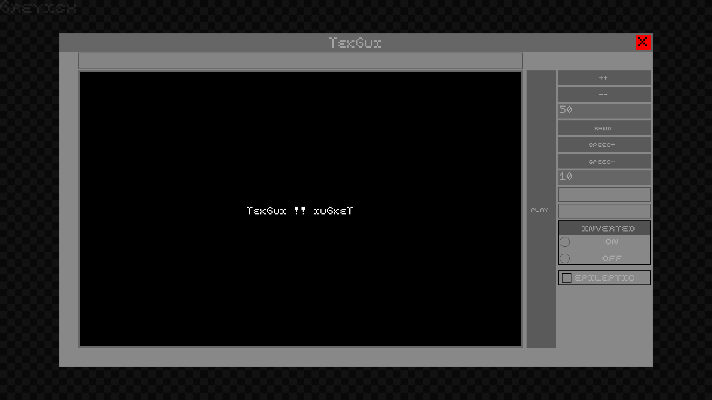

# TekGui



Made with Liblapin 1.6.3 (from Jason Brillante) !!! (File explorer no longer working on 1.7 and higher, don't know why for the moment)

Interesting project, we had to create a graphical lib that could generate windows.

We also had to make a documentation.

Screenshots are available !

## Usage

Just run :
```
cd bin
make
```

and
```
./tekgui ../demo/file_name.ini
```

Two .ini examples are in the demo folder

## Scores

Moulinette : 100%
Pitch : 45